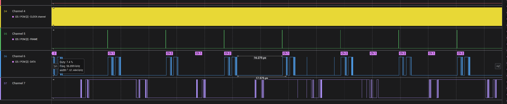

# SERDES

This is a proof of concept (POC) intended to show the ability to serialize data over an existing I2S bus that is transporting audio.  The POC consists of two [MIMXRT685-AUD-EVK](https://www.nxp.com/design/development-boards/i-mx-evaluation-and-development-boards/i-mx-rt600-audio-evaluation-kit:MIMXRT685-AUD-EVK) boards - one acting as the master which is the audio source and the other acting as the slave which will receive the I2S stream and serialize or deserialize any data that is not on a designated audio channel (hence the name SERDES for serializer-deserializer).

## Proof of Concept Layout

A generalized depcition of the POC layout is shown in the image below.  In this image, the two boards are connected by a single I2S bus for receive and transmit.  The master is connected to the onboard codec ([Cirrus Logic CS42448](https://www.cirrus.com/products/cs42448/)) which serves as the audio source for the proof of concept.  When triggered, the master board starts communication with the codec (i.e. receiving input audio from the codec) and starts the clocks (bit clock and frame sync) for the bridge communication between the master and the other devices on the line (the amp and the slave device).

Aside from the slave board, the system also consists of a [MAX98388](https://www.analog.com/en/products/max98388.html) amp from Analog Devices.  This amp can be configured to receive data in time domain multiplexed (TDM) format on a particular channel.  In addition, the amp can be configured to return IV data similarly in TDM format on particular channels.  Data is inserted on the configured channel and all other channels are held in a high impedance state allowing other devices on the line to insert data on other channels. (Another amp is shown in this image only to demonstrate a potential configuration but is not part of the actual POC).

Although also depicted is a microphone acting as a source of PCM data, this will not be part of the proof of concept.  It is provided simply to demonstrate other possible sources of data on the return line of the master.

In addition to the codec on the master, the audio EVK provides other built in peripherals including switches and LEDs.  In this POC, the system will respond to a button presson on the slave by inserting data into the receive stream on the master.  When the master receives the data from the switch press, it will respond with a change in an LED state.

### I2S Configuration

For the RT685, I2S can be configured for individual channel _pairs_ up to 4. The sampling rate for the POC is set at 48 kHz with a sample resolution of 32-bits.  The system is configured to run at 256 bits/frame - this assumes 8 channels for each frame.  The bit clock is set to run at

$$
f_{bit_clock} = N_{bits}\times{f_{sample}}\times{N_{channels}}\\
 = 32\times48000\times8\\
 = 12.288\mbox{ MHz}
$$

So, given 8 32-bit channels sampled at 48 kHz, the bit clock is expected to run at 12.288 MHz while the frame sync runs at the sample rate, or 48 KHz.  The transmit bit and frame sync clocks on the master are intended to be shared with both the slave as well as the receive lines on the master.

While the clocks are an explicit input for the slave, the transmit clocks are shared with the receive line by setting the appropriate registers.  For the transmit line, the clock is shared by setting  `SHAREDCTRLSET` for the appropriate Flexcomm port properly - the `SHAREDSCKSEL` and `SHAREDWSSEL` bit must be set.  For the receive line which is using the shared clocks, the `FCCTRLSEL` register mus be properly set by setting the `SCKINSEL` and `WSINSEL` bits for the `SHAREDCTRLSET` set by the master (there are two shared sets that can be used and the clock that is shared may be shared with all I2S Flexcomm ports).

While the system is designed for a frame to consist of 8 channels, not all 8 will be explicitly used by either the slave or the master.  Channels (slots) not explicitly configured remain in a high impendance state.  **There is not explicit configuration for setting a slot to be high impedance.** The high impedance state of a line allows other devices to drive the line and insert data at the proper position.

The current configuration of the POC has the master transmitting on two channels and receiving on two channels.  The two transmit channels are for transmitting audio to the amplifier and data to the slave.  The slave is configured to transmit on a single channel pair.  The slave transmits data on the second pair (`PAIR_1`) while the master receives data from the slave on that pair and IV data from the aplifier on the third pair (`PAIR_2`).  Currently, the master is configured to transmit data on the final channel pair (`PAIR_3`) but **the slave is not currently set up to receive on that pair**.

### Wiring

Both the slave and the master use two I2S busses: Flexcomm 4 and 5.  On the AUD-EVK, these ports are located on J27 and J28 respectively.  The wiring for the I2S busses are as follows:

| Port    | Pin | Flexcomm Bus | I2S function |
| ------- | --- | ------------ | ------------ |
| J27     |  1  |   4          |      DATA    |
|         |  2  |              |      WS      |
|         |  3  |              |     SCK      |
| J28     |  4  |  5           |   DATA       |
|         |  5  |              |      WS      |
|         |  6  |              |      DATA    |
|         |  7  |              |     GND      |

In order to route the Flexcomm 5 data line to the Arduino header, jumper JP41 must be set to position 2-3 (the default position is 1-2).  For diagnostic purposes (i.e. use with a logic analyzer), Switch 2 input is triggered as an output on P0_5 which can be accessed on J30 pin 1.

## Board Functions

### Determining Board Role

Either board can be configured via hardware to be master or slave.  To configure the board as slave, set P0_6 to low; conversely, to set the board as master, set the value to high.  P0_6 is found on the Arduino header J30, pin 2.  To set the value low, ground can be pulled from J29 pin 7.  For master, pin 4 can be attached to pull the line high.  When the board is configured as slave, the blue user LED will be on at boot.

### Transmitting I2S from the Master

The initial state of the master I2S bus is inactive. **The current state of the POC is that no activity can happen on the bus _unless_ the master is active.**  To start transmission, press Switch 2 on the master.  This will start a tone transmission (use of the onboard Codec for audio transmission is currently not ready).  When transmission begins, the green user LED will turn on.

### Transmitting Data from the Slave

The slave will transmit data when

1. the master is currently transmitting (i.e. the I2S clocks are active)
2. Switch 2 is pressed on the slave

When the button is pressed, then data will be placed on the master receive line (slave transmit).  The data that will be transmitted consists of 1) the source (as defined by the enum `data_src_t`; currently only `SRC_GPIO` is implemented), 2) data and 3) the data length.  The data is currently only intended to fit with in a single slot (channel pair) and is therefore limited in size to 64 bits with the start and source consuming 4 bits each, the length 8 bits, data 5 bytes and the CRC at the end 1 byte. The start nibble is 0xD.  This was required in the POC to distinguish noise on the line from data.

The CRC is currently an 8-bit value that is calculated as follows:

$$\text{crc} = \sum_{i=0}^{7} (\text{crc} \oplus (\text{buffer}[i] \& 0xFF) \ll (8 \times i))$$

Data to toggle the LED high on the master looks like:

| Start (4 bits) | Source (4 bits) | Length (8 bits) |  Data (40 bits) | CRC (8 bits) |
| -------------  | --------------  | --------------  | --------------- | ------------ |
|      0xD       | 0x0             |   0x1           |     0xFF        |   0xB7       |

When Switch 2 is toggled again, the same packet is sent with the data set to 0x00 and the CRC calculated as 0x18.

## MAX98388 Configuration

### Hardware Setup

In this setup, there are two audio EVKs that have two distinct roles: master and slave.  The role is determined by a single setting - the level on PIO0_6.  Access through PIO0_6 is provided via the Arduino header J30, pin 2.

Hardware connections are made through the AUD INT 3 39-pin connector on the MAX evaluation kit.  Pinouts are numbered from the bottom right when facing the pin.  Pin 1 is in the top right, pin 2 is the next row down and pin 3 is the first pin in the bottom row.  The next pin after one on the top row is 4 etc.

Power is provided to the evaluation kit through the 30 pin connector using 1.8 Vdd from the NXP evaluation kit on master.  Jumpers on the NXP EVK are taken from J28 and ground is provided via J25.  Ground is routed to pin pin 3 and Vdd is routed to pin 20 in the middle row.

| Signal | NXP Header | NXP Pin | AUD INT 3 Pin | Notes |
| ------ | ---------- | ------- | ------------- | ----- |
|  GND   |    J25     |   1     |      3        |  |
|  Vdd   |    JP28    |   1     |      20       | This is a jumper used for power measurements |
|  SDA   |    J19     |   18    |      26       | 50 mil pins require a breakout |
|  SCL   |    J19     |   20    |      29       | See above |
| BCLK   |   J27      |   3     |      5        | FC4 on Master |
| WS     |   J27      |   2     |      8        | See above |
| DataIn |   J27      |   1     |      11       | See above |
| DataOut |           |         |      14       |           |

The I2C setup uses 2.2k pull-ups to Vdd (1.8 V).  These pull ups are not provided on the NXP eval board and the amp board has these as DNP.

### Register Config

The MAX98388 is configured as follows at boot.  Communication is strictly through the master board.  Audio is received via Flexcomm 4 in slot 0.  The amplifier _must_ be configured at system boot - there is no on board non-volatile memory on the dev kit.  The amp is initialized via I2C (pins described above) on Flexcomm 3.  Flexcomm 3 is repurposed from the I2S out for the onboard Codec of the master.  The I2C bus is configured as master with a baudrate of 100 kbps.  The amplifier address used here is the default address of the amplifier - address pin is tied to VDD - so the value is 0x70.  As the address is a 7-bit address, the value is shifted left by 1 bit.

After the I2C bus has been initialized, the amplifier is configured.  The following register values are set for the given register addresses. Technically, only registers which values are not set to the default actually have to be set.  For completeness sake, all writable configuration registers are provided.

| Register Name                   | Address | Value | Explanation of values |
|---------------------------------|---------|-------| ----------- |
| THERMAL_WRN                     | 0x2020  | 0x0A  | Default     |
| SPK_MON_THRESH                  | 0x2031  | 0x58  | Default     |
| SPK_MON_LOAD                    | 0x2032  | 0x08  | Default     |
| SPK_MON_DUR                     | 0x2033  | 0x02  | Default     |
| ERROR_MON_CTL                   | 0x2037  | 0x01  | Default     |
| PCM_MODE_CFG                    | 0x2040  | 0xD9  | PCM Configuration: Transmit HiZ at extra bclk cycles. Rising FS starts new frame. Sample interleave disabled. TDM mode 0. 32-bits per sample. |
| PCM_CLK_SETUP                   | 0x2041  | 0x08  | PCM Clock: 256 bits per frame sync.  Valid data on the rising edge of the bclk. |
| PCM_SAMPLE_RATE                 | 0x2042  | 0x88  | PCM Sample Rate: 48 kHz for both IV data out and audio data in. |
| PCM_TX_CTL1                     | 0x2044  | 0x10  | Configure slot for voltage data: slots 16/17. |
| PCM_TX_CTL2                     | 0x2045  | 0x14  | Configure slot for current data: slots 20/21. |
| PCM_HIZ_CTL1                    | 0x2050  | 0xFF  | Default; hiz output for transmitter channels not used. |
| PCM_HIZ_CTL2                    | 0x2051  | 0xFF  | Default; same as above. |
| PCM_HIZ_CTL3                    | 0x2052  | 0xFF  | Default; same as above. |
| PCM_HIZ_CTL4                    | 0x2053  | 0xFF  | Default; same as above. |
| PCM_HIZ_CTL5                    | 0x2054  | 0xFF  | Default; same as above. |
| PCM_HIZ_CTL6                    | 0x2055  | 0xFF  | Default; same as above. |
| PCM_HIZ_CTL7                    | 0x2056  | 0xFF  | Default; same as above. |
| PCM_HIZ_CTL8                    | 0x2057  | 0xFF  | Default; same as above. |
| PCM_RX_SRC1                     | 0x2058  | 0x00  | Default |
| PCM_RX_SRC2                     | 0x2059  | 0x10  | Route PCM data for channel 0 to input channel 0 and channel 1 to input channel 1. |
| PCM_TX_DRV_STR                  | 0x205C  | 0x01  | Default. |
| PCM_TX_SRC_EN                   | 0x205D  | 0x03  | Enable voltage and current data feedback. |
| PCM_RX_EN                       | 0x205E  | 0x01  | Enable PCM input. |
| PCM_TX_EN                       | 0x205F  | 0x01  | Enable PCM data output. |
| SPK_VOL_CTL                     | 0x2090  | 0x00  | Default; full volume output. |
| SPK_CH_CFG                      | 0x2091  | 0x02  | Default. |
| SPK_AMP_OUT_CFG                 | 0x2092  | 0x03  | Default. |
| SPK_AMP_SSM_CFG                 | 0x2093  | 0x01  | Default. |
| SPK_AMP_EDGE_RATE_CTL           | 0x2094  | 0x0F  | Default. |
| SPK_CH_PINK_NOISE_EN            | 0x209E  | 0x00  | Default. |
| SPK_CH_AMP_EN                   | 0x209F  | 0x01  | Speaker channel is enabled anytime the globale enable is set. |
| IV_DATA_DSP_CTL                 | 0x20A0  | 0x10  | Default. |
| IV_DATA_EN                      | 0x20A7  | 0x03  | Current and voltage transmit channels are enabled. |
| BRWNOUT_PROT_ALC_THRESH         | 0x20E0  | 0x04  | Default. |
| BRWNOUT_PROT_ALC_RATES          | 0x20E1  | 0x20  | Default. |
| BRWNOUT_PROT_ALC_ATTN           | 0x20E2  | 0x06  | Default. |
| BRWNOUT_PROT_ALC_RELEASE        | 0x20E3  | 0x02  | Default. |
| BRWNOUT                         | 0x20E4  | 0x33  | Default. |
| BRWNOUT_PROT_ALC_INF_HOLD_RELEASE | 0x20EE | 0x00  | Default. |
| BRWNOUT_PROT_ALC_EN             | 0x20EF  | 0x00  | Default. |

## Results

Given the setup described above, we were able to stream audio (a tone), transmit IV data from the amp back to the master and insert data from the slave into the transmit line for the master.  The major obstacle was noise on the transmit line likely due to a poorly laid out setup (lots of exposed lines).  Changing the data start nibble from 0x1 to 0xD helped to delineate data sent in a logic trace, but any noise on the receive line resulted in a bad CRC.

### Amp I2S

## Next Steps

Here are some points for next steps of investigation:

* Role switching and waking master from sleep.  In this scenario, the master has shifted into a lower power mode and the slave wishes to transmit data on the master's receive line.  Wake-up functionality is described in 25.3.1 of the _RT6xx User Manual_ (UM11147).
* Develop more robust data communication protocol that allows the slave to send extended data over multiple frames.
* Measure latency for different data communication scenarios including wake from sleep.
* Measure power consumption for different communication scenarios.

# Resources

NXP. (2022, Febuary 17). *I2S Bus Specification v3*, https://www.nxp.com/docs/en/user-manual/UM11732.pdf.
NXP. (2020, Febuary 28). *AN12749: I2S Transmit and Receive on RT500 HiFi4*, https://style.nxp.com/docs/en/application-note/AN12749.pdf.