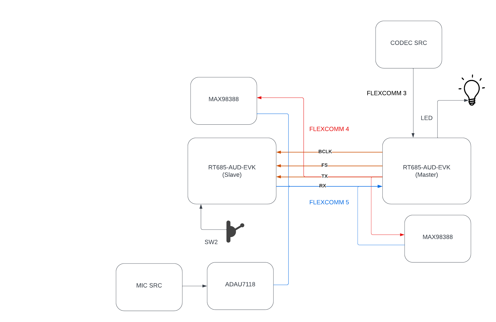

# SERDES

This is a proof of concept (POC) intended to show the ability to serialize data over an existing I2S bus that is transporting audio.  The POC consists of two [MIMXRT685-AUD-EVK](https://www.nxp.com/design/development-boards/i-mx-evaluation-and-development-boards/i-mx-rt600-audio-evaluation-kit:MIMXRT685-AUD-EVK) boards - one acting as the master which is the audio source and the other acting as the slave which will receive the I2S stream and serialize or deserialize any data that is not on a designated audio channel (hence the name SERDES for serializer-deserializer).

## Proof of Concept Layout

A generalized depcition of the POC layout is shown in the image below.  In this image, the two boards are connected by a single I2S bus for receive and transmit.  The slave is connect to the onboard codec ([Cirrus Logic CS42448](https://www.cirrus.com/products/cs42448/)) which serves as the audio source for the proof of concept.  When triggered, the master board starts communication with the codec (i.e. receiving input audio from the codec) and starts the clocks (bit clock and frame sync) for the bridge communication between the master and the other devices on the line (the amps and the slave device).

Aside from the slave board, the system also consists of one or two [MAX98388](https://www.analog.com/en/products/max98388.html) amps from Analog Devices.  These amps can be configured to receive data in time domain multiplexed (TDM) format on a particular channel.  In addition, the amps can be configured to return IV data similarly in TDM format on particular channels.  Data is inserted on the configured channel and all other channels are held in a high impedance state allowing other devices on the line to insert data on other channels.

Although also depicted is a microphone acting as a source of PCM data, this will not be part of the proof of concept.  It is provided simply to demonstrate other possible sources of data on the return line of the master.

In addition to the codec on the master, the audio EVK provides other built in peripherals including switches and LEDs.  In this POC, the system will respond to a button presson on the slave by inserting data into the receive stream on the master.  When the master receives the data from the switch press, it will respond with a change in an LED state.

### Wiring

I2S busses on flexcomms 4 and 5 are located on J27 and J28 respectively.  The wiring is as follows

| Port    | Pin | Flexcomm Bus | I2S function |
| ------- | --- | ------------ | ------------ |
| J27     |  1  |   4          |      DATA    |
|         |  2  |              |      WS      |
|         |  3  |              |     SCK      |
| J28     |  4  |  5           |   DATA       |
|         |  5  |              |      WS      |
|         |  6  |              |      DATA    |
|         |  7  |              |     GND      |

### Jumper Settings

JP41 - 2-3
JP42 -

## RT685 Capabilities

## Functions

Blue LED indicates that the board is acting as a slave and is on at boot.

Green LED is lit when the master is transmitting on the bridge.

Pressing switch two on the master will start I2S transmission.

Pressing switch two on the slave will load a request for lighting up the LED on the master

## MAX98388 Configuration

### Hardware Setup

Hardware connections are made through the AUD INT 3 39-pin connector on the MAX evaluation kit.  Pinouts are numbered from the bottom right when facing the pin.  Pin 1 is in the top right, pin 2 is the next row down and pin 3 is the first pin in the bottom row.  The next pin after one on the top row is 4 etc.

Power is provided to the evaluation kit through the 30 pin connector using 1.8 Vdd from the NXP evaluation kit on master.  Jumpers on the NXP EVK are taken from J28 and ground is provided via J25.  Ground is routed to pin pin 3 and Vdd is routed to pin 20 in the middle row.

| Signal | NXP Header | NXP Pin | AUD INT 3 Pin | Notes |
| ------ | ---------- | ------- | ------------- | ----- |
|  GND   |    J25     |   1     |      3        |  |
|  Vdd   |    JP28    |   1     |      20       | This is a jumper used for power measurements |
|  SDA   |    J19     |   18    |      26       | 50 mil pins require a breakout |
|  SCL   |    J19     |   20    |      29       | See above |
| BCLK   |   J27      |   3     |      5        | FC4 on Master |
| WS     |   J27      |   2     |      8        | See above |
| DataIn |   J27      |   1     |      11       | See above |
| DataOut |           |         |      14       |           |

### Register Config

The register configuration was setup using the Windows GUI utility provided with the MAX EVK.

| Register Name                   | Address | Value |
|----------------------------------|---------|-------|
| THERMAL_WRN                     | 0x2020  | 0x0A  |
| SPK_MON_THRESH                  | 0x2031  | 0x58  |
| SPK_MON_LOAD                    | 0x2032  | 0x08  |
| SPK_MON_DUR                     | 0x2033  | 0x02  |
| ERROR_MON_CTL                   | 0x2037  | 0x01  |
| PCM_MODE_CFG                    | 0x2040  | 0xD9  |
| PCM_CLK_SETUP                   | 0x2041  | 0x08  |
| PCM_SAMPLE_RATE                 | 0x2042  | 0x88  |
| PCM_TX_CTL1                     | 0x2044  | 0x10  |
| PCM_TX_CTL2                     | 0x2045  | 0x14  |
| PCM_HIZ_CTL1                    | 0x2050  | 0xFF  |
| PCM_HIZ_CTL2                    | 0x2051  | 0xFF  |
| PCM_HIZ_CTL3                    | 0x2052  | 0xFF  |
| PCM_HIZ_CTL4                    | 0x2053  | 0xFF  |
| PCM_HIZ_CTL5                    | 0x2054  | 0xFF  |
| PCM_HIZ_CTL6                    | 0x2055  | 0xFF  |
| PCM_HIZ_CTL7                    | 0x2056  | 0xFF  |
| PCM_HIZ_CTL8                    | 0x2057  | 0xFF  |
| PCM_RX_SRC1                     | 0x2058  | 0x00  |
| PCM_RX_SRC2                     | 0x2059  | 0x10  |
| PCM_TX_DRV_STR                  | 0x205C  | 0x01  |
| PCM_TX_SRC_EN                   | 0x205D  | 0x03  |
| PCM_RX_EN                       | 0x205E  | 0x01  |
| PCM_TX_EN                       | 0x205F  | 0x01  |
| SPK_VOL_CTL                     | 0x2090  | 0x00  |
| SPK_CH_CFG                      | 0x2091  | 0x02  |
| SPK_AMP_OUT_CFG                 | 0x2092  | 0x03  |
| SPK_AMP_SSM_CFG                 | 0x2093  | 0x01  |
| SPK_AMP_EDGE_RATE_CTL           | 0x2094  | 0x0F  |
| SPK_CH_PINK_NOISE_EN            | 0x209E  | 0x00  |
| SPK_CH_AMP_EN                   | 0x209F  | 0x01  |
| IV_DATA_DSP_CTL                 | 0x20A0  | 0x10  |
| IV_DATA_EN                      | 0x20A7  | 0x03  |
| BRWNOUT_PROT_ALC_THRESH         | 0x20E0  | 0x04  |
| BRWNOUT_PROT_ALC_RATES          | 0x20E1  | 0x20  |
| BRWNOUT_PROT_ALC_ATTN           | 0x20E2  | 0x06  |
| BRWNOUT_PROT_ALC_RELEASE        | 0x20E3  | 0x02  |
| BRWNOUT                         | 0x20E4  | 0x33  |
| BRWNOUT_PROT_ALC_INF_HOLD_RELEASE | 0x20EE | 0x00  |
| BRWNOUT_PROT_ALC_EN             | 0x20EF  | 0x00  |

# Resources

NXP. (2022, Febuary 17). *I2S Bus Specification v3*, https://www.nxp.com/docs/en/user-manual/UM11732.pdf.
NXP. (2020, Febuary 28). *AN12749: I2S Transmit and Receive on RT500 HiFi4*, https://style.nxp.com/docs/en/application-note/AN12749.pdf.